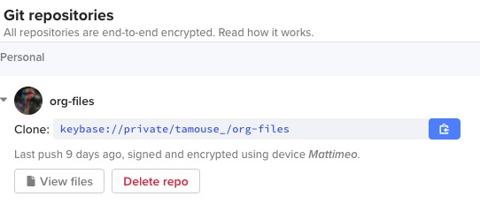

The [Keybase.io](https://keybase.io) provides a Git server to provide an end-to-end encrypted way to access and store a git remote repo. This is helpful for repos you don't want visible to the public, at any point. Some private repos are still visible in some ways, but the ones on Keybase enjoy strong encryption all the way through.

## Keybase command line ##

To see the git capabilities, try this from the command line:

``` shell

$ keybase git help
NAME:
   keybase git - Manage git repos

USAGE:
   keybase git <command> [arguments...]

COMMANDS:
   create	Create a personal or team git repository.
   delete	Delete a personal or team git repository.
   gc		Run garbage collection on a personal or team git repository.
   lfs-config	Configures a keybase git checkout to use LFS
   list		List the personal and team git repositories you have access to.
   settings	View and change team repo settings
   help, h	Shows a list of commands or help for one command

```

## How I use it ##

I have a repo of emacs `org-mode` files kept in a local .git repo. To make a keybase git remote, I do the following things:

``` shell

$ pushd ~/org
$ keybase git list
$ keybase git create org-files
$ git remote rename origin oldorigin
$ git remote add origin keybase://private/tamouse_/org-files
$ git push -u origin master

```

## Keybase GUI ##

You can also create a new repository from the Git tab in the Keybase app.

For existing repos, you can get the remote url to set the local git remote to.

### Example ###




