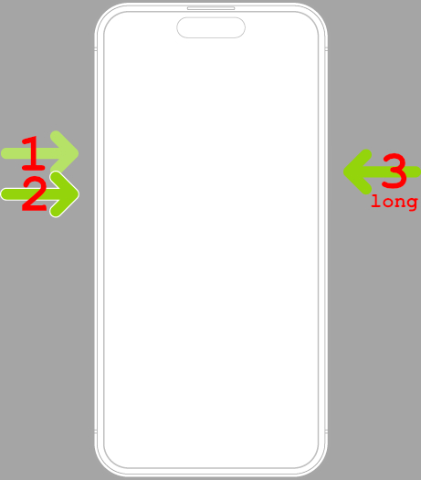

# How to force restart an iPhone 11 Pro

Source: <https://support.apple.com/guide/iphone/force-restart-iphone-iph8903c3ee6/ios>

Turns out, it's sort of easy, if you can push the buttons in the exact right way.

I managed to set off the emergency call sequence that dialed 911, and everyone on my ICE list :facepalm: 

> If iPhone isn’t responding, and you can’t turn it off then on, try forcing it to restart.

1. Press and quickly release the volume up button.
2. Press and quickly release the volume down button.
3. Press and hold the side button.
4. When the Apple logo appears, release the side button.

